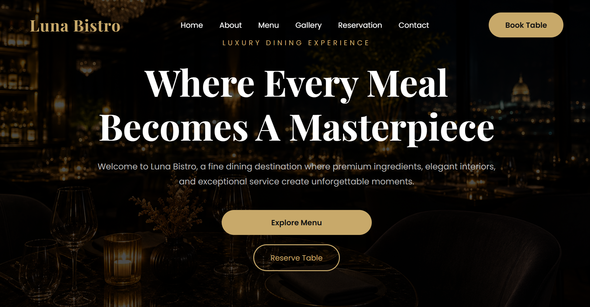

# Luna Bistro | Fine Dining Restaurant
## 📸 Website Preview



## ✨ Features

A modern and elegant restaurant website built with **HTML, CSS, and JavaScript**, featuring a luxury dark-themed design, responsive layout, menu sections, gallery, testimonials, reservation form, and restaurant information.

## ✨ Features

- Fully responsive design
- Luxury dark and gold visual theme
- Responsive hamburger navigation
- Hero section with call-to-action buttons
- About Us section
- Restaurant menu section
- Food and interior gallery
- Chef section
- Customer testimonials
- Online reservation form
- Contact and restaurant information
- Responsive footer
- Mobile, tablet, and desktop friendly layout

## 🛠️ Technologies Used

- HTML5
- CSS3
- JavaScript
- Font Awesome
- Google Fonts

## 📁 Project Structure

```text
restaurant/
│
├── css/
│   └── style.css
│
├── images/
│   ├── hero.jpg
│   ├── interior.jpg
│   └── ...
│
├── js/
│   └── script.js
│
├── 404.html
└── index.html

🎨 Design

Luna Bistro uses a sophisticated dark color palette with elegant gold accents to create a premium fine-dining atmosphere.

The layout focuses on:

-Clean typography
-Strong visual hierarchy
-Elegant spacing
-High-quality imagery
-Smooth hover effects
-Responsive design
📱 Responsive Design

The website is designed to work across:

Desktop
Laptop
Tablet
Mobile devices

The navigation automatically changes to a hamburger menu on smaller screens.

```
## 🚀 Live Demo

[View Live Website](https://webdevhira-cloud.github.io/restaurant/)
```

## 👩‍💻 Author

**Hira Malik**

Frontend Developer

Built as a portfolio project using HTML, CSS, and JavaScript.

📌 Purpose

This project was created as a frontend development portfolio project to demonstrate responsive web design, modern UI development, layout structuring, and basic JavaScript functionality.


